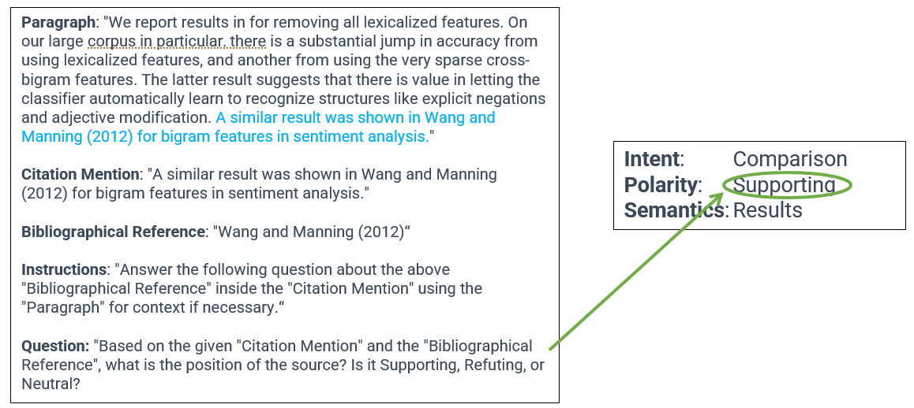

# SciNoBo Citance Analysis (CA) tool
This repository contains the files for the Citance Analysis Agent.

The tool takes a scientific citation mention (citance) and tries to determine its **Intent**, **Polarity** and **Semantics** for a specific citation mark inside the citance. If a publication PDF is given instead of a citance and a citation mark, then `GROBID` is used to extract all citances and then each of them is assessed by the system. The system uses finetuned LLMs in an **instruction-based question answering task** similar to [(Stavropoulos et al)](https://aclanthology.org/2023.nlposs-1.5/), to determine the:

**Intent** (purpose/function/intent of the citance):
- Generic : generic reference to the cited work
- Reuse : the authors reuse an aspect of the cited work
- Comparison : the authors compare their work to the cited work

**Polarity** (stance or attitude of the authors towards the citances):
- Supporting : the authors support an aspect of the cited work
- Neutral : the authors do no take a stance for or against the cited work
- Refuting : the authors refute an aspect of the cited work

**Semantics** (content/object/meaning of the citation mention):
- Claim : the authors refer to the claim of the cited work
- Methodology : The authors refer to the methodology or approach used in the cited work
- Results : The authors refer to the results or findings presented in the cited work
- Artifact : The authors refer to a specific research artifact of the cited work, such as a dataset, software, model, etc.

For the analysis, we use an **Instruction Fine-tuned Large Language Model (LLM)** in a **Question Answering (QA)** setting, employing different prompts to classify the **Intent**, **Polarity** and **Semantics**.

For the classification, the sentence of the citances is given as input to the model, along with its paragraph as context for better understanding.



Current version uses the finetuned `Flan-T5 Base` model.

## Info

The tool provides two main endpoints:

1. **Infer Citance**: This functionality allows you to infer the polarity, intent, and semantics of a single citance. The endpoint for this functionality is `/infer_citance`.

2. **Infer Citances**: This functionality allows you to infer the polarity, intent, and semantics of a list of citances. The endpoint for this functionality is `/infer_citances`.

Each endpoint expects a POST request with a JSON body containing the required parameters. The specific parameters for each endpoint are detailed in the API documentation.


## Docker Build and Run

To build the Docker image, use the following command:

```bash
docker build -t scinobo_citance_analysis .
```

To run the Docker container

### Server:
```bash
docker run -e BSIZE=16 --rm --gpus all -p 8000:8000 scinobo_citance_analysis uvicorn citance_analysis.server.api:app --host 0.0.0.0 --port 8000
```

This will serve the uvicorn server of `server.py` which supports the `/infer_citance` and `/infer_citances` endpoints.

### Bulk Inference for (text , PDF, TEI XML or parquet) files:
```bash
docker run -e BSIZE=16 -e GROBID_URL='https://kermitt2-grobid.hf.space' --rm --gpus all -p 8000:8000 -v /host/directory:/container/directory scinobo_citance_analysis python -m citance_analysis.pipeline.inference --input_dir /path/to/input/inside/container --output_dir /path/to/output/inside/container
```

Make sure that you specify paths inside the `/app/external` container directory, which is reserved for the bulk PDF input.

The `GROBID` module is used for PDF processing,. You can specify the GROBID url endpoint using the environment value `GROBID_URL` and the `-e` flag.

The `BSIZE` environment value is for the batch_size to use when multiple citances are given.

Example:

```bash
docker run -e BSIZE=16 -e GROBID_URL='https://kermitt2-grobid.hf.space' --rm --gpus all -p8000:8000 -v /my_path_to_folder/mypdfs:/app/external/input scinobo_citance_analysis python -m citance_analysis.pipeline.inference --input_dir /app/external/input/ --output_dir /app/external/output/
```

Other flags:
- `--input_dir`: Directory with PDF files to process.
- `--output_dir`: Output directory to save the results.
- `--xml_mode`: Use TEI XML files (GROBID output) instead of PDFs.
- `--parquet_mode`: Run the pipeline for parquet files instead of PDFs that contain the columns: "id", "citation_mentions".
- `--filter_input`: Wildcard pattern to filter input files to analyze.

## Conda

For conda use :

`conda run --no-capture-output -n docker_env python -m` 

instead of:

`python -m` 

in the above snippets.
